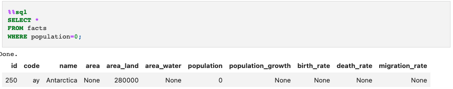

# CIA World Factbook

## Purpose

The purpose of this project was to utilize SQL and Jupyter Notebook to create a SQL database using data from the CIA World Factbook and make inquiries into the data to discover 3 things: which country had the highest population, which country had the lowest population, and which country had the highest population growth. The data from the CIA World Factbook database contain a statistical profile of every sovereign country on Earth as well as various territories that do not have offical 'country' status, including demographic information, population growth, GDP per capita, and land and water area.

## Analysis

By running the queries for the most populated country, we can see that the most populated country on earth is the People's Republic of China at around 1.4 billion people.

The country with the least amount of people on earth is Antactica with a population of 0.

Looking at populaiton growth, we can see that the country with the highest population growth rate is the Republic of South Sudan.

